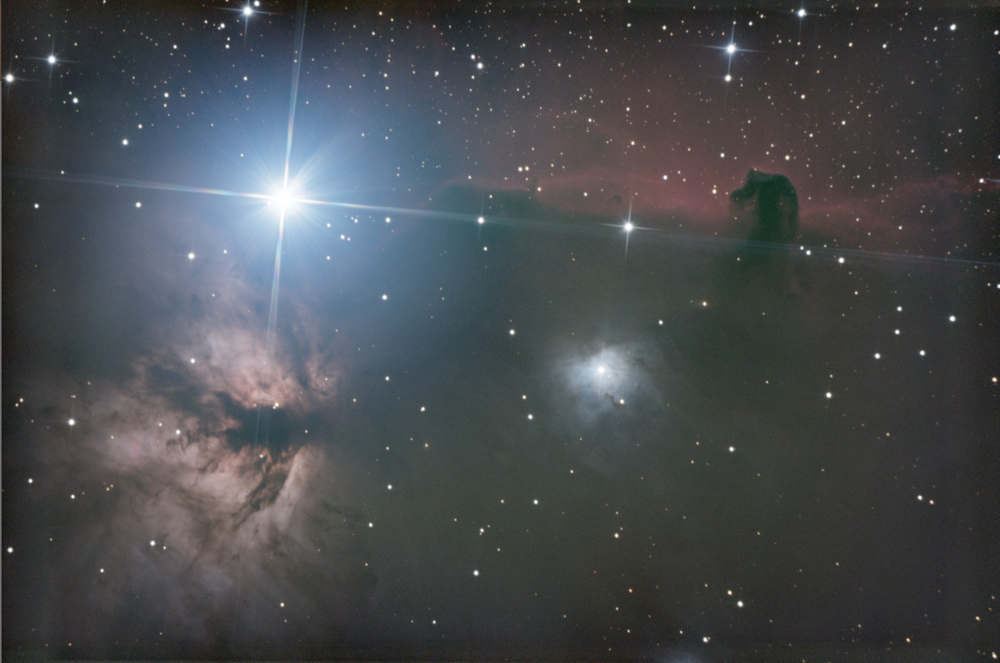
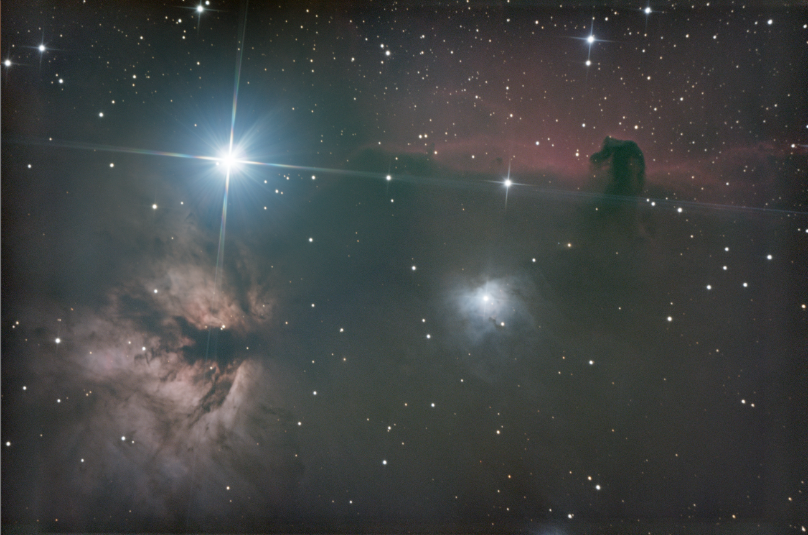

  
**View on Flickr:** https://www.flickr.com/photos/156021928@N02/53584924191

### About the Nebulae
The Horsehead Nebula, known formally as Barnard 33, and the Flame Nebula, designated as NGC 2024, are two iconic astronomical features located in the constellation Orion, serving as spectacular showcases of the universe's beauty and complexity. The Horsehead Nebula is easily recognizable by its distinctive dark silhouette that resembles a horse's head when viewed against the bright backdrop of emission nebula IC 434. This striking contrast is created by thick dust clouds that absorb the glow of the ionized hydrogen gas behind them. Nearby, the Flame Nebula presents a fiery appearance, with its glowing gas and dark dust lanes that outline the features of an ethereal blaze. This nebula is illuminated by the bright star Alnitak, which is part of Orion's Belt, contributing to the Flame Nebula's vivid red and orange hues. Together, these nebulas not only highlight the processes of stellar formation and the interstellar medium's dynamics but also captivate observers with their breathtaking vistas.

### Acquisition
I like to think that shooting any target offers new learning opportunities and ways to challenge oneself. With this target, however, I wasn’t expecting much trouble, as it's very popular for good reason. It’s bright, easy to spot in the night sky, and the nebula’s features are quite distinct. To make things interesting, I started a friendly competition with my friend Mathieu to see who could produce a better image. His telescope boasts a wider field of view, and he was utilizing filters to enhance certain parts of the nebula's gas. However, with my remote observatory setup, I was in a position to gather more data. He captured his data a few nights before me and produced this image.

*Mathieu's rendition of the horsehead nebula*

I collected three nights' worth of data on the target, totaling 490 subframes. However, during processing, I discovered that Alnitak was completely overwhelming the image. A combination of my narrow field of view and less-than-ideal seeing conditions meant that the star was creating a halo that covered a significant portion of the image, with diffraction spikes that spanned its entirety. Yet, all problems are just learning opportunities, and this presented me with the chance to experiment with masking. I used PixInsight to create a circular mask around the star with a highly feathered edge, and then applied histogram and curves transformations to the masked area to reduce the halo's color and brightness to background levels. Here, you can see a side-by-side comparison.

  
  
*Before and after, reducing the stars halo*

From there, I brought the image into Photoshop and manually shortened the spikes. All stars naturally have diffraction spikes when shooting with a telescope like mine, so I didn't want to totally remove them, instead I just reduced them to stop them from overwhelming the image and covering the horsehead.

Mathieu and I never really decided on a winner. Both shots highlight different things, and are unique in their own way. Overall, we were both really pleased with how the images turned out, and I was happy that even on a "basic" target, there was lots for me to learn.

### Image Details
- **Light Frames:** 490 frames, 50 seconds exposure per frame, 1600 ISO
- **Dark Frames:** 150 
- **Bias Frames:** 50  
- **Flat Frames:** None  

### Pixinsight Workflow
- Photometric Color Calibration
- Dynamic Background Extraction
- BlurXTerminator
- NoiseXTerminator
- Histogram Transformation
- Curves Transformation
- Star Mask
    - Histogram Transformation
    - Curves Transformation

