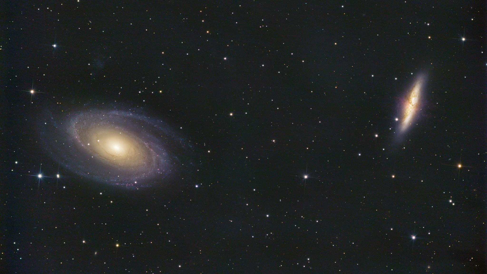
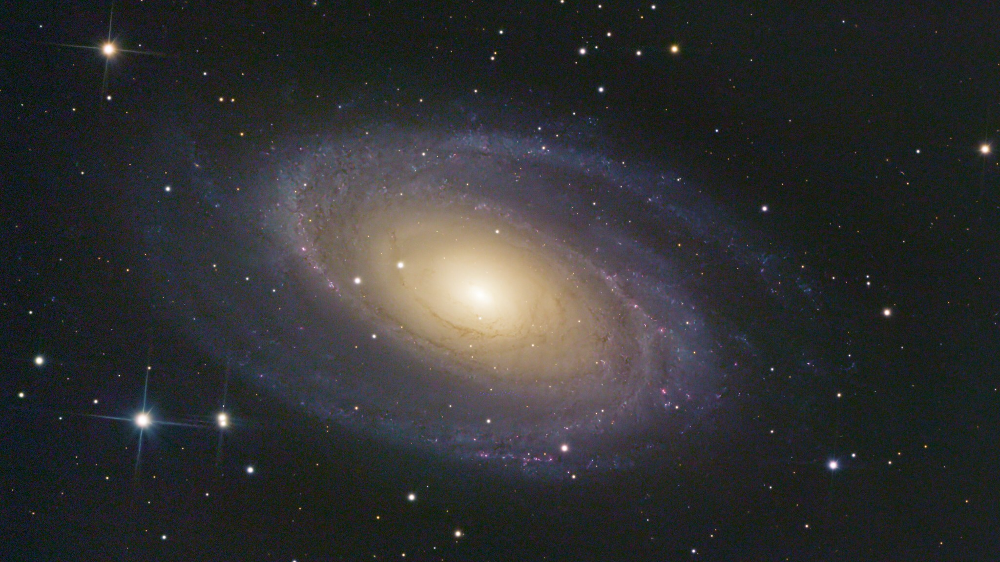
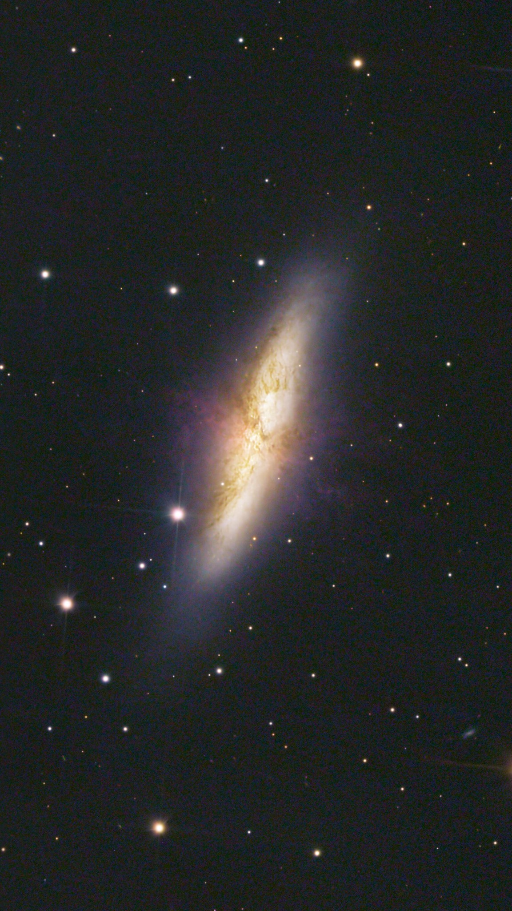

**View on Flickr:** https://www.flickr.com/photos/156021928@N02/53543422109/
### About M81

M81, also known as Bode's Galaxy, is a grand spiral galaxy located in the constellation Ursa Major. At approximately 12 million light-years away from Earth, M81 is one of the brightest galaxies observable in the night sky, making it a popular target for both amateur and professional astronomers. This galaxy is notable for its well-defined spiral arms, which are rich in star formation, and its active galactic nucleus, suggesting the presence of a supermassive black hole at its core. The gravitational interactions between M81 and its neighbors, particularly M82, have sparked significant interest in the astronomical community, as these interactions offer insights into the dynamics of galaxy evolution and the processes that shape the universe.
### About M82

M82, or the Cigar Galaxy, stands in stark contrast to its neighbor, M81, in the constellation Ursa Major. Approximately 12 million light-years from Earth, M82 is a starburst galaxy, characterized by an exceptional rate of star formation. This intense activity is believed to have been triggered by M82's gravitational interactions with M81, leading to a dramatic increase in the formation of young, hot stars and causing the galaxy to glow brightly in infrared light. M82 is also known for its striking appearance, with its central starburst region producing powerful outflows of gas and dust, visible as dark lanes and filaments against the galaxy's luminous core. These features make M82 a fascinating subject for studying the effects of gravitational interactions on galaxy morphology and star formation.

### Acquisition
This project was a big deal for me. I spent over 12 hours gathering data on the target and picked up some new tricks for processing along the journey. The image I ended up with made me really proud—it had such vibrant colors and amazing detail. What surprised me most was how close the quality of my image came to those taken by the Hubble telescope, using just amateur equipment on the ground.

*Left: Hubble photo of M81. Right: my attempt*

*Left: Hubble photo of M82. Right: my attempt*
Fun fact, besides the two obvious galaxies, there are at least 10 more that I've managed to spot in the image. Can you spot them all?

In this image alone, there are probably thousands more galaxies we haven't spotted yet—they might be too dim or simply haven't been logged. Still, I've only marked the galaxies I know for sure. In the grand scheme of things, the space captured in this image is just a tiny fraction of the universe's vastness. It's hard to comprehend just how immense space truly is—stretching out in all directions, seemingly endless and boundless. Imagine billions upon billions of galaxies, each containing billions of stars, and potentially even more planets. The sheer scale is mind-boggling, and it's a constant reminder of how much we have yet to explore and understand. In this vast cosmic ocean, our little corner of the universe is just a speck, yet it holds endless mysteries waiting to be uncovered.

My workflow for this image was entirely different than what I've done before, and I wanted to highlight a few of the tools that I used that I think really made the difference here

First, this image is a drizzle integration.

The second is photometric color calibration. When you take a normal image, your camera can usually automatically determine the white balance of the image to produce a good result. However, with astrophotography the white balance must be calculated manually. The way I used to do this was by selecting a star to serve as my white reference, and an empty patch of space as my black reference, and calibrating that way. However, space isn't totally black, and stars aren't actually white. Photometric color calibration on the other hand is much more sophisticated. Essentially, it uses plate solving to look at the image and compare against a database of stars, and pattern matches to figure out what stars its looking at. From there, it grabs data about the color temperature of the stars in the image from that same database, and uses that as the color reference to calibrate the image. This enables much more accurate color calibration and ensures that the images is closer to a "true" color (although what true color is in astrophotography is not always clear). You can learn more about PCC here: https://pixinsight.com/tutorials/PCC/

The third is BlurXTerminator (https://www.rc-astro.com/software/bxt/). This is an AI powered sharpening tool that greatly enhances the sharpness of the images. I was initially hesitant to use AI tools, as I was worried that it would create a final product that was not representative of what was captured, but these are not generative AI tools, it is just a better sharpening tool than the ones I was already using, and the work it does is incredible. I'm currently still using the free trial of the software, but I think I'll end up buying it and incorporating it into my regular workflow

The final one is the curves transformation. Histogram editing is a tool that comes standard with virtually any image processing software, but I always found it mildly daunting. I used to increase saturation by following a tutorial I found online that had you separate the luminance layer, darken the shadows a bit, and then reapply it as a saturation mask. I never thought much about how the process worked as the results looked great, but what it was basically doing was increasing saturation across the image, while keeping the darkest parts of the image dark. You can do this all with curves transformation but with much greater control, if you just take the time to learn it. I also took a fair bit of time to modify the curves for R, G, and B to enhance the difference between the blues of the galactic edge and the yellow cores. Going forward I will incorporate this into my workflow as well.

### Image Details
- **Light Frames:** 901 frames, 50 seconds exposure per frame, 1600 ISO
- **Dark Frames:** 40  
- **Bias Frames:** 50  
- **Flat Frames:** None  

### Pixinsight Workflow
- Photometric Color Calibration
- Dynamic Background Extraction
- BlurXTerminator
- NoiseXTerminator
- Histogram Transformation
- Curves Transformation

