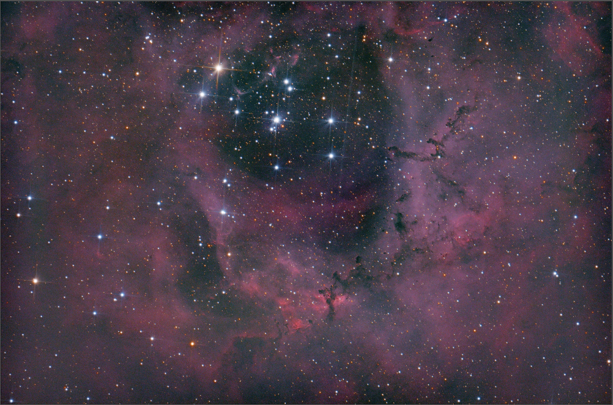

**View on Flickr:** https://www.flickr.com/photos/156021928@N02/53588074677

### About the Nebula
The Rosette Nebula, officially cataloged as NGC 2237, is an expansive cloud of gas and dust located in the Monoceros constellation, lying approximately 5,000 light-years from Earth. This astronomical feature derives its name not from a rose, but from its resemblance to a classical ornamental rosette, with its intricate pattern of interstellar material sprawling across space. Centered by the open star cluster NGC 2244, whose stars were born from the very material of the nebula itself, the Rosette Nebula is illuminated from within. The intense radiation from these young, hot stars excites the nebula’s gas, causing it to emit light and create the visually striking patterns that are reminiscent of a rosette’s design. Spanning about 50 light-years in diameter, the Rosette Nebula serves as both a breathtaking spectacle in the night sky and a critical region for studying the processes of star formation and the evolution of interstellar clouds.

### Acquisition
This shot was the first mosaic I captured, yet I initially did not intend for it to be. I started shooting the Rosette one night after my previous target got too low on the horizon. The nebula is too large to fit in frame with my telescope so I decided to focus on a region of the nebula that contained these dark spires of gas that protruded from the clouds, as it looked visually interesting. After two nights of capturing, I liked the detail and features but the framing was all wrong. The center of the nebula was in an awkward position and it was making the overall image look quite strange.

*Two nights of rosette data on the lower portion of the nebula*
I ended up with a dilemma. I only had one night left before I'd be taking the observatory offline for a few weeks, and once it would be online again the nebula would be too low in the sky for this year. If I changed the framing I wouldn't be able to collect as much data on the existing regions, but it could help improve the overall quality of the image.

I decided to go for it, and captured a 3rd night with a different framing. I combined both shots together using Pixinsight's mosaic tools to produce the final image. The wider field-of-view of the final image compensated well for the fact that there was less data captured for each region, and it ended up being my favorite Astro photo that I've taken so far. I'm hoping that when this nebula is above the horizon again, I'll be able to shoot it in narrowband and really pull out some detail.

### Image Details
- **Light Frames:** 510 frames, 60 seconds exposure per frame, 1600 ISO
- **Dark Frames:** None 
- **Bias Frames:** 50  
- **Flat Frames:** None  

### Pixinsight Workflow
- Photometric Color Calibration
- GradientCorrection
- MosaicByCoordinates
- BlurXTerminator
- NoiseXTerminator
- Histogram Transformation
- Curves Transformation

