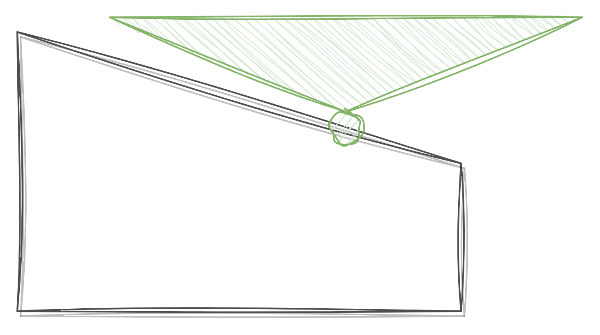
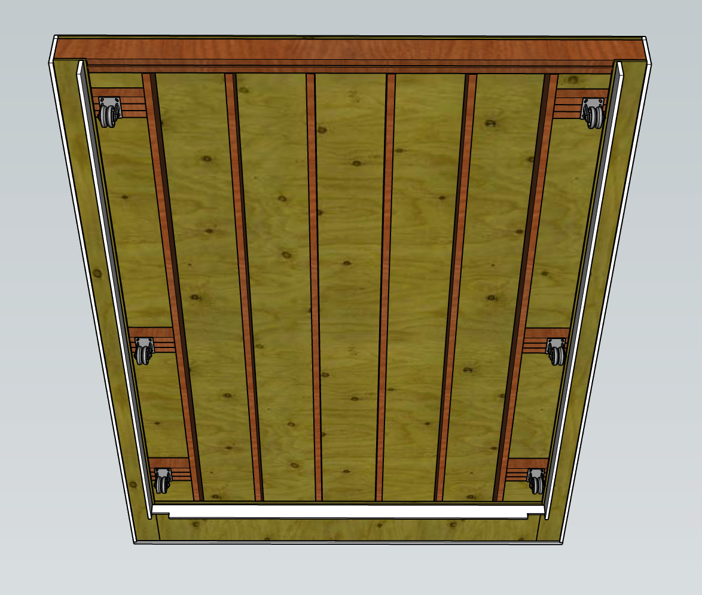
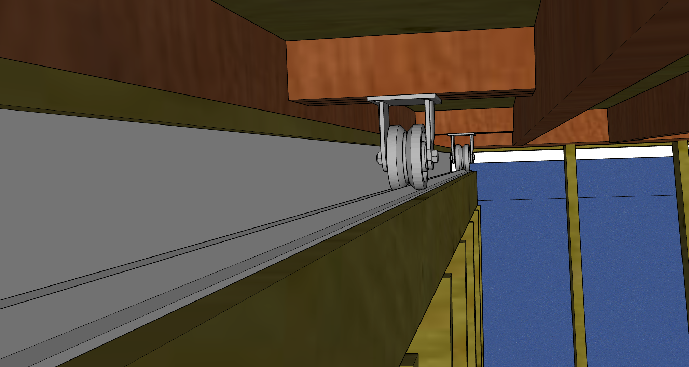
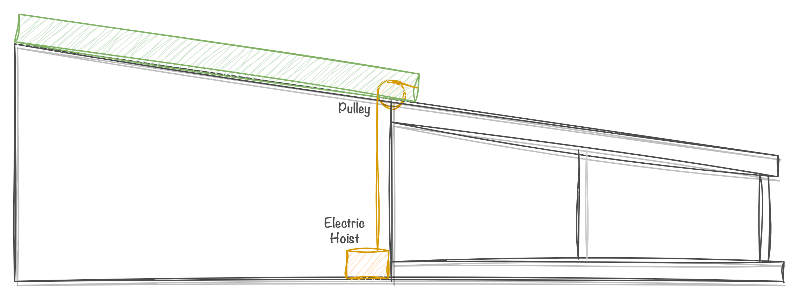

The first task in designing my observatory was selecting a location. I was renting an apartment in Montreal at the time, so I didn't have a backyard to put it in. However, the company I was working at developed rocket engines, and we had a big open test site far outside the city where they were willing to let me build the structure. The location was perfect, no light pollution, lots of space, and well secured. With this decided, I set the requirements for my project

Requirements
- Must protect the telescope and equipment from rain and snow when closed
- When open, should allow viewing angles of 30 degrees above the horizon in any direction
- Should be able to be operated fully remotely, without an operator present on-site
- Should be able to be transported to a new location, leaving nothing permanent behind in the old location
    - This was a requirement set by the location that I was building it in

While researching designs for the observatory structure, I discovered that there are two main types of observatories people construct: domes and roll-off roofs. Domes represent the classic observatory design, featuring a hemispherical dome equipped with a shutter that opens to grant the telescope a view of the stars. They excel at providing broad viewing angles while shielding the telescope from the elements, all while boasting an impressive appearance. Roll-off roofs, on the other hand, offer a simpler design, resembling a shed with a roof that slides along a track, thereby exposing the telescope to the sky.
| | | 
|---|---|
| |  |
*Left: A roll-off roof observatory*
*Right: A dome observatory*

Originally, my plan was to build a dome observatory, but after doing more research I was turned away from the concept. While cool, they are much harder to build than a rolling roof, and have two moving axis instead of one. Additionally, their primary benefit over rolling roofs (increased viewing angles) is not that important, as astrophotography targets below a certain elevation from the horizon are usually not good to shoot anyway due to increased atmospheric haze and light pollution. On top of this, dome observatories can even be worse than rolling roof observatories. The small opening in the dome means that the telescope takes longer to cool down to ambient temperature at night, causing heat shimmer and distortion while observing. As a result, I decided to go with a rolling-roof design.

The specific style of rolling roof I chose was a result of a few competing issues I had. The first had to do with the requirement of leaving nothing behind if I had to relocate it. Normally, observatories will put their telescope on a concrete pier that is buried into the ground a few feet. This is done to make the telescope immune to vibrations, and keep it aligned without shifting over time. Because of my requirement of leaving nothing behind, a concrete pier was out of the question. My plan instead was to use the tripod that came with my mount as the base and extend the legs through the floor of the observatory to rest on the ground. This would isolate it from vibrations and I would evaluate over time to see if it could maintain alignment. However, to achieve this the telescope needed to be fairly close to the ground for a tripod to work. If i wanted good viewing angles, this would mean that the roof also had to  be low to the ground around the telescope.

This conflicted with a nice-to-have requirement of mine. I wanted the roof to be tall enough that I could work inside the structure without crouching. I wanted to have a small desk inside that would allow me to work on setting up and modifying the telescope comfortably. To be able to meet both of these requirements, I started designing a lean-to roof structure. A lean-to roof uses a single sloped roof element, creating a profile with low walls on one side and high walls on the other. By combining this with a rectangular building shape, I could put the telescope near the low-walled side, and the distance from the telescope to the high-walled side would be such that I would still get the 30 degree viewing angle I wanted. All this meant that I could make the structure tall enough to work in, and would even be able to fit a full-sized door in the building.

*Observatory outline in white, approximate field of view of the telescope in green*

To work out the overall structure dimensions I setup my telescope in my apartment and laid out the shape with tape. I measured the height of the telescope at various angles to make sure the roof angles would work, and walked around the stand in the tape box to get a sense of the space I'd have to work in. I settled on an 8'x10' building, with the high wall being exactly tall enough for a standard framed door, and a roof angle of 15 degrees (I debated going for a shallower angle to give more space inside the building, but I needed a steep enough angle to allow snow to slide off).

With the overall dimensions set, this is what I designed:

*Observatory with the roof lowered*

*Observatory with the roof raised*

*Showing the interior, with the telescope and a small desk for controlling the telescope from*

The main structural elements of the observatory are 4 beams made by glueing two 2x6 boards together. Because I couldn't put any concrete into the ground, I wanted a very rigid frame that wouldn't flex and move due to frost in the winter (as this could throw the roof mechanism or telescope out of alignment). Two of these beams run along the bottom of the structure and connect to the floor joists, and the other two are the rails that the roof slides on.

The walls are standard 2x4 construction, uninsulated with a product called LP Smartside as the siding. Smartside is sheets of OSB with a plastic coating on the outside that has a nice siding pattern stamped on it. Its cheap, provides cross-bracing for the structure, and doesn't require a backing material.

The rolling roof design is very simple. The roof slides on rails using 3 wheels on each side. On one side, the wheels use a v-groove and an upside-down piece of angle iron to keep from shifting left or right while moving up the rails. The other side uses flat wheels on a metal plate, since only one side needs to be constrained to avoid the roof shifting, using flat plates here ensures that the roof doesn't bind.

*The full rolling roof assembly, showing the wheels it uses to move on the rails*

*close-up showing the v-groove wheel resting on the angle-iron track*

To raise and lower the roof, I use an electric hoist. The hoist sits on the floor and runs over a pulley on the lower wall and connects to the roof. The hoist pulls the roof up and includes a built-in brake to hold position, and uses gravity to lower. 

*Diagram showing the roof raising and lowering mechanism*

With the design coming together, I started working on the construction. I still had some open questions about how to keep bugs and birds from getting into the gaps in the roof, and exactly how to design the automation, but I had enough of a rough idea that I felt comfortable with starting to move forward on the construction.
