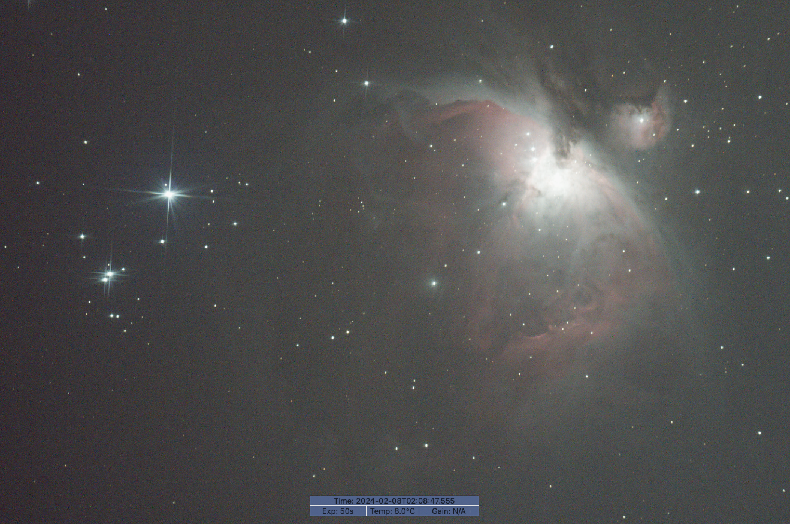
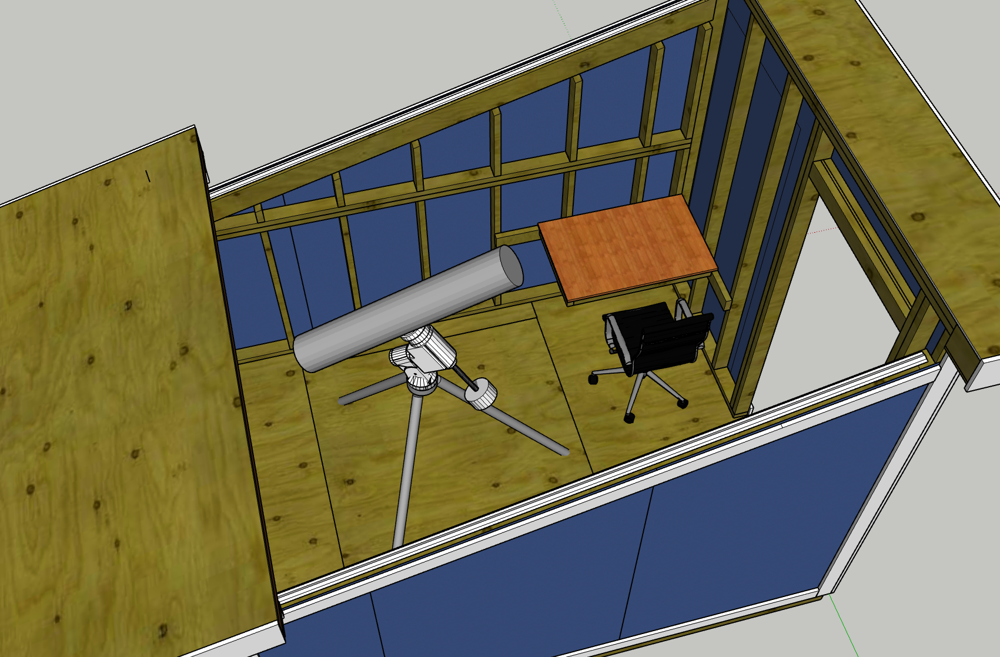
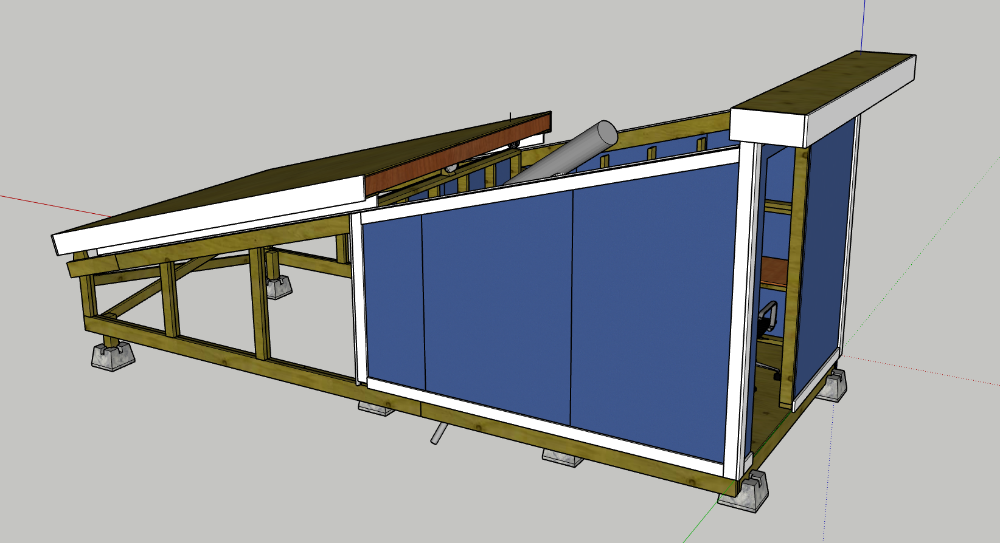

Now that I had a design I was satisfied with, I was ready to start building the structure. My timing was less than ideal however, as it was January in Montreal and the location I wanted to build the structure was buried under multiple feet of snow. Unbothered by this issue and anxious to get started on construction, I got to work.

The first step was to remove the snow for the foundation. this alone took a full day, as there was 3 feet of snow in some places.

I rented a U-Haul and got most of my lumber at once as it wouldn't fit in my car.

The beams that would become the main supports for the structure were made and two of the floor joists added to create a frame for the structure. The frame was lifted onto the concrete blocks that form the foundation, and he structure was levelled.

From there the remaining floor joists were added as well as the plywood flooring. The easy parts of the walls also went up at this time.

*Building the walls with help from my friend and fellow astro-nerd Mathieu*

*Walls installed*
The beams that would hold the rails were then added, as well as their support structure. At this point it started to actually look like the design!

*My girlfriend visited for the weekend and helped with the install of the rails*
At this point I could start on the roof. I wanted to create a "Minimum Viable Product" for the roof system to test if my design would work, so that meant the base structure required to hold the roof and a basic frame for the roof itself, along with the wheels and rails.

*Rails installed for guiding the roof as it moves*

*Minimum viable product roof, consisting of a frame, the wheels, and some 2x4s to cross brace it*

*At this stage I was using a hand winch to test this, the electric hoist came later*
Success! The mechanism was smooth and working well. The track was doing its job in keeping the roof from moving side to side as well. Adding the rest of the components to the roof would increase the weight a lot and would affect how it moved, but the initial tests gave me the confidence to keep moving on with the project.

The next step was to finish the roof coverings. I wanted to get this done so I could start protecting the plywood flooring with the roof and prevent water damage. This resulted in a slightly strange looking building with a finished roof but no finished walls.

*The remaining roof joists were added, as well as plywood to create the roof backing*

*Trim boards were added next. The trim has to go on before the roof as the drip edge goes over the trim*

*Roofing felt installed*

*Drip edge and roof panels installed*
Now the roof was complete! Next steps were to add the walls, door, and stairs. My dad was visiting for the weekend and helped with the wall installation.

*Walls, door, and stairs installed*

*Painted*

*Trim Installed*
And with that the structure is basically complete! The only work to still finish on the structure was to add trim around the roof to seal it from animals getting inside. At this point in the project it was now August, having taken about 7 months to construct the structure. I had been doing the work on weekends and had been lucky to maybe get one day a week that I could go out and do the work. Now that it was ready, I could start setting up the telescope inside and preparing to take my first images inside the observatory! 