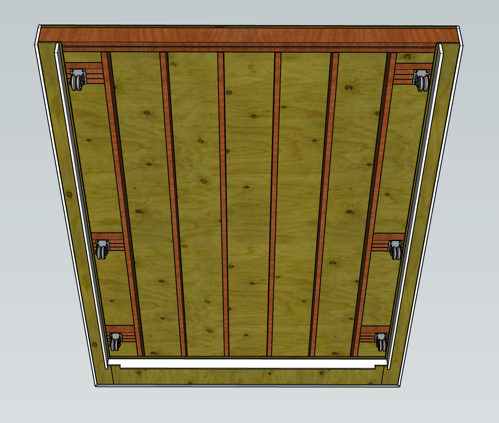
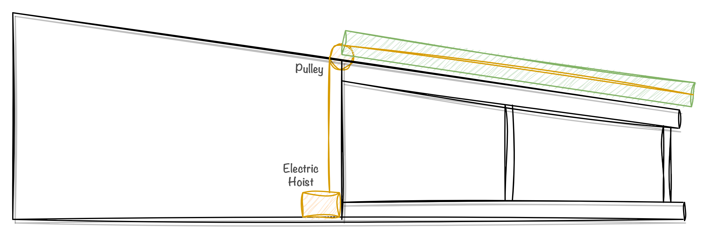
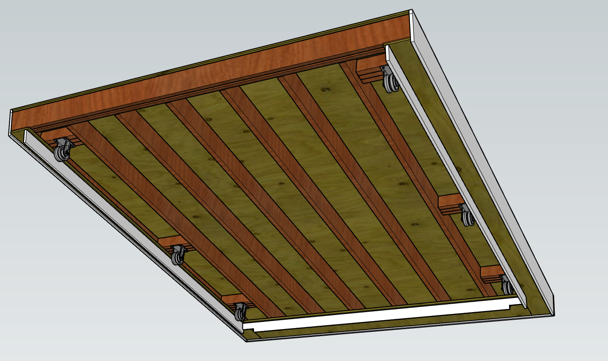

  

First light at an observatory is always a special moment. It's the first time you aim your telescope at the stars and capture your initial images. Now that the structure was complete, I was ready to install the telescope and capture the first light. This was the culmination of my efforts, and I was incredibly excited to discover if all my hard work had come to fruition.

  

At this point my telescope setup consists of my mount, telescope tube, camera, and an electric auto-focuser. I set this all up and ran wires for power and control of each piece of equipment. Its important for the harnesses to have enough slack that the telescope can turn on all of its axes freely

I made a few small shelves out of the leftover wood to hold the support electronics. This includes a network switch and a mini-pc that will act as a server for controlling the telescope. In the future, some of the equipment for automating the roof will go here as well.

With everything in place, The observatory was ready to observe! To perform the observations, I use 3 pieces of software for controlling the telescope

**INDI:** An open-source server for telescope control, containing drivers for interfacing with all of the most common astrophotography equipment  
**KStars:** The GUI application to select targets in the night sky  
**Ekos:** An extension for Kstars for interacting with the INDI server  

To capture a photo with this setup, there are a few steps to perform
1. Alignment. When you first turn on the telescope, it doesn't necessarily know where its pointing. This can be solved using a technique called plate solving. Essentially, you take a photo with the telescope, and Ekos will compare that photo against a database of known stars, pattern matching them to figure out exactly where you are looking. 
2. Focusing. The telescope has an electric focuser, which is just a motor that moves the drawtube in and out to achieve focus. Focus is achieved by taking short photos at various focal lengths and comparing the apparent size of stars in view, optimizing for minimal star size (and thus good focus). 
3. Framing. when setting up Kstars, you provide information about your telescope and camera that it uses to calculate your field of view. It makes a rectangle from this that is overladed over a planetarium view to show you what your camera will see in a certain area. Using this you can line up a photo and then command the telescope to move to this position
4. Capture. Using Ekos, you can capture individual images or setup sequences of captures to run for hours.

Once you have it working, its almost like magic. You have an entire planetarium view in front of you with hundreds of targets available. All you have to do is click on one and the telescope moves into position and starts capturing images. I took a video showing this process on the Andromeda galaxy on a later night, but it shows the process well.

<video src="ekos-demo.MOV" width="100%" controls></video>

The target I chose for first light was M101, a spiral galaxy in Ursa Major. It was particularly interesting to me as a supernova had recently exploded in the galaxy and would be visible with my telescope for only a short window, and I was excited to capture the result. Once I had finished my aliment, focusing, and framing, I ran it overnight and came back the next morning to check on the results....

Wow. The improvement in quality from being able to run it all night was amazing. It was vindication that building an observatory had been the right call, and I was starting to see the workflow that would allow me to collect hours and hours of data easily. My work wasn't over though. This is still a fairly manual process, and requires me to be on-site for the observations. This wasn't exactly achieving my dream of controlling the telescope from the comfort of my own home. To do that, I'd need to introduce some automation into the setup for telescope and roof control. For now though, I was quite happy with the setup, and would take a few of my best photos in the coming months.