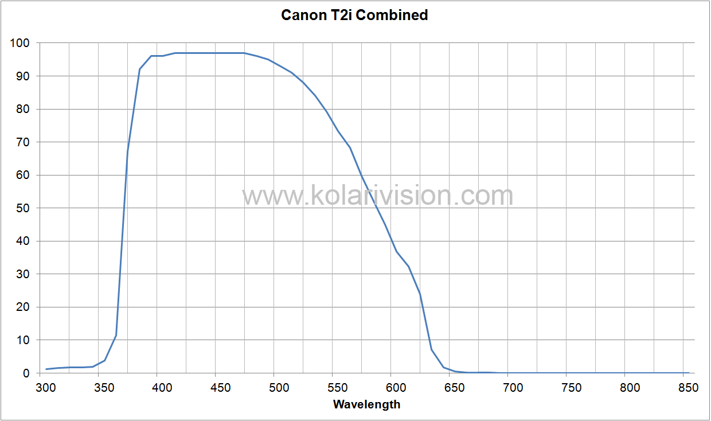
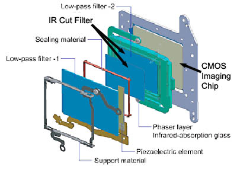

After capturing the first light with the observatory, I got more ambitious. I wanted to try for more faint targets and see what I would be able to capture. I decided on the wizard nebula, a beautiful emission nebula surrounding an open cluster of stars that promised to be challenging but not impossible to capture. I found a clear night, prepared my equipment and captured a full night of data on the target. The results were...underwhelming.

The number of stars in the image is beautiful, but the nebula is hardly visible. Only the core is barely exposed and was missing a lot of the interesting details I had expected to capture. For the amount of integration time and brightness of the nebula, I was expecting more. What went wrong?

The reason this photo turned out so poorly didn't take long to discover. The wizard nebula, like most emission nebula, is made up mostly of hydrogen gas. The gas absorbs the ultraviolet light from the star cluster it surrounds and re-emits it at very specific wavelengths. The strongest and most prominent wavelength is hydrogen-alpha, with a wavelength of 656.3 nanometers. This wavelength is still considered visible light, and my DSLR sensor is able to capture light emitted at this wavelength, however the problem lies in the IR-cut filter. All DSLR cameras include this filter to remove IR wavelengths and produce an image that is close to what your eyes would see. While great for terrestrial photography, this filter clips some redder visible wavelengths, making it a problem for astrophotography.

*Source: https://kolarivision.com/articles/internal-cut-filter-transmission/*

The above graph shows the cameras sensitivity to light at different wavelengths using the IR-Cut filter. I couldn't find this graph for my specific camera (Canon T5i), so this T2i graph will have to suffice. Looking at the graph, we can see that at 656.3 nanometers the signal is nearly entirely attenuated. No wonder the nebula is nearly invisible!

The solution to the problem is to remove the filter from the camera. This process is often called astromodding, and there are a few different ways of doing it, including removing other filters that attenuate ultraviolet, or installing new filters for various wavelengths. I elected to just remove the IR-cut filter.

  

The process to do this is not straightforward. The filters are mounted directly to the image sensor and removing them requires fully disassembling the camera. It is also imperative that dust does not get on the image sensor, as it can ruin the quality of your images. Removing the filter was necessary if I wanted to shoot any emission nebulae though, so i got to work.

*Both front and back housings of the camera need to be removed to get access to the image sensor*

*Sensor assembly removed*
One of the challenges with removing the filter is getting the image sensor perfectly flush with the camera body. If they are off, the focus across the image sensor may not be the same, resulting in poorly focused images. The sensor is mounted using three spring-loaded screws that are factory calibrated to line up the sensor. To ensure that each screws was returned to the exact same depth as before, I used a depth gauge to measure how far the screws were inserted to within one turn, and then torque striped the head. Using these in combination allowed the sensor to remain flush with the camera body after the astromod.

*IR Cut filter removed. The glass broke during removal, good thing its not needed anymore!*

*All of the screws removed from the camera for the sensor modification process*
With the filter removed I reassembled the camera and patiently waited for another clear night. It didn't take long, and I setup the newly modified camera to image the wizard nebula a second time. I captured a similar amount of data compared to the previous attempt, with the only difference being the modification of the camera. The results speak for themselves

The nebula's previously visible sections have significantly brightened, and regions once cloaked in invisibility have now emerged. The transformation is so dramatic that it looks like an entirely new nebula! 

A lot of things could have gone wrong when modifying the camera, but the result was totally worth it! I'm very excited to start shooting more emission nebula and see what I am able to capture with this new setup.