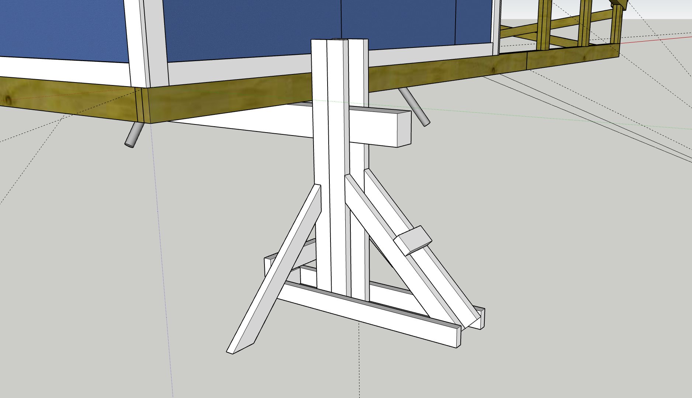

In an unfortunate twist of fate, just as I was finishing the observatory, it was time to move it. 

I had taken a new job that fall, and it meant I was leaving Montreal and moving to Virginia. This meant the observatory couldn't stay, and with no place to put it in my new home it was decided that instead it would be moved to my parents home in Ontario. Their property is outside the city and away from light pollution, and would be perfect for an observatory. I would also be able to control it from Virginia with the automation I had planned.

Planning the move took some time. There is a big difference between designing a structure to be moved and actually moving it, especially when we had to move it 700km between two provinces. I knew I wanted to do it without hiring movers, as the cost to transport a structure this big that far would be astronomical, so instead I enlisted my dad to help with the planning and moving. 

We knew we could use a truck and trailer to move the observatory, but the question was how to lift the structure up onto the trailer and get it off on the other side. We had watched a lot of videos of people moving sheds of similar sizes, and the standard method seemed to involve using a farm jack and a pile of whatever material they had laying around to prop it up, and pray that you could get the trailer underneath it before it tipped off and fell. We wanted a more secure method than this, partly for our own safety but partly because of our time constraints. 

Renting the truck and trailer wasn't cheap, and my dad was coming to Montreal to help with the move, so we had to get everything done over the weekend in as few days as possible. We didn't have a lot of time to experiment with methods, and instead had to be more conservative with our plan to be sure that it would work the first try. 

The plan we settled on was to use some leftover wood we had to make beams for lifting. There would be two beams, and each beam would sit inside a jig that would keep it stable as we raised it. We would use bottle jacks to slowly raise the beam up and secure it every few inches as we hit the top of the jacks stroke.

*CAD design showing the beam and its support jig. The beam moves up and down inside the jig to lift the structure using bottle jacks.*
While I was home visiting for Christmas, we built the beams and jigs, and finished planning the move.

Our plan for the move was:  
**Friday:** My Dad picks up the truck and trailer in London, drives to Montreal  
**Saturday:** We spend the day lifting the observatory onto the trailer and securing it  
**Sunday:** Drive from Montreal to my parents home, get the observatory off the trailer  
**Monday:** Return the truck and trailer in the morning.  

Creating a schedule for something you've never done before is hard. It is also challenging to account for things that may go wrong during the process. Given how inflexible our timeline was, this was the biggest concern for me. I was especially concerned as this was mid-January and unpredictable weather threatened our schedule. We didn't have much choice though, and started decided to give it a try.
#### Friday
**9:00am:** I get a text from my dad that he's picked up the truck and trailer and is on his way  
**12:00pm:** I head out to the observatory to do some final prep work ahead of moving it, while waiting for my Dad to arrive  
**4:00pm:** I get a call from my Mom. While on the way to Montreal, the trailer had lost a wheel and my Dad is currently stranded on the highway. The good news is that nobody was injured, the bad news is that the entire wheel assembly has fallen off the trailer and needs to be fixed.  
**5:00pm (1 hour behind schedule):** My dad gets the trailer off the highway and to a garage. they'll fix it but they don't have the parts, and the parts store closed a few minutes ago. He's stuck for the night.  
#### Saturday
**8:00am (16 hours behind schedule):** My dad picks up the parts and takes it to the mechanic. Because we have no appointment, he will have to wait until he can find a time to do the repairs.  
**12:00pm:** The mechanic finally starts working on the trailer, only to discover that the nut he had bought was the wrong thread pitch. For a second time that weekend, the parts store had closed only minutes ago, with the next closest being an hour away  
**2:30pm:**  New parts acquired, returned to the mechanic to assemble the wheel again  
**4:00pm:** Mechanic has finished the work on the trailer, truck and trailer are back on the road!  
**7:00pm (24 hours behind schedule):** Truck and trailer arrive at the observatory.  

At this point we are a full day behind schedule. Its 7:00 at night and pitch black out. We considered delaying, but our options were limited. If we pushed back a day, we would run the risk of driving into snow squalls that were forecasted to hit, and we couldn't push back to another weekend as I was moving to Virginia the next weekend. We had to get it done in the original timeframe. So, we got to work.

*Worklights setup to begin the lifting operation*
**8:00pm:** We installed our beams and began lifting. Lifting progress was surprisingly smooth and without problems.  

**10:00pm:** The observatory was now at deck height for the trailer. The terrain around the observatory meant that we wouldn't be able to back the trailer in the correct orientation for transport. Instead we would have to set it perpendicular on the trailer, and then move it to a more open spot before rotating it into its proper orientation on the trailer.  

<video src="observatory-snow.MOV" width="100%" controls></video>

#### Sunday
**12:00am:** The trailer was backed under and the observatory was lowered onto the trailer deck. We decided this was as far as we'd go for the night, and we'd pick it up in the morning.  

**2:00am:** After some dangerous driving through the snow, we got back to my apartment and slept for the night.

**8:00am (16 hours behind schedule):** Head back out and get to work. Our next task was to move the trailer and observatory out to an open space so we could rotate it into a transportable position. This was a very slow process as the trailer needed to be backed through a narrow opening and the structure wasn't entirely stable.

**1:00pm:** The trailer was now moved to an open position and we could start rotating it. This involved reinstalling the beams and lifting up a few inches so that we could remove the trailer and back it in with the correct orientation.
| | |
| --- | --- |
| |  |
|  |  |
*Rotating the trailer under the observatory*

**4:00pm:** With the trailer oriented properly, we just had to strap everything down, clean up and get on the road. We installed eyebolts in the frame of the observatory to attach ratchet straps on, allowing us to secure the structure down.  

**7:00pm (18 hours behind schedule):** We were on our way! We decided to start the drive and see how far we wanted to go that night before stopping at a hotel.

<video src="observatory-on-truck.MOV" width="100%" controls></video>

#### Monday
**1:00am:** We had been driving for 6 hours. Progress was slow, the observatory had the aerodynamic profile of a brick wall and the weight of one too, meaning that the truck was struggling to get much above highway speeds. It also meant we had to stop regularly for gas. However, the night driving was proving to be an excellent idea, as there were virtually no cars on the highway. We decided to press on and try to make it all the way without stopping.  

**5:00am (12 hours behind schedule):** We arrived, exhausted, and went to sleep.

**1:00pm:** After getting some much needed rest, we went to finish the final step, lowering it off the trailer. The grass was too soft to put the observatory in its final location so we had to sit it down just off the driveway and move it again once the ground froze. This step was relatively painless, as we had gotten our technique figured out and had a smooth process working. 
<video src="lowering-timelapse.MOV" width="100%" controls></video>

**4:00pm (18 hours behind schedule):** It was done! The observatory had crossed provincial lines and made it to its final home intact. All that was left was to return the truck and trailer, and for me to return to Montreal to prepare for my move the following week.

Overall, I had a lot of fun. It was stressful and exhausting, but it was also a great learning experience and an adventure. I also couldn't have done it without my dads help. He was involved in the planning and execution at every step, and without him I'm not sure I'd have even attempted it. The move was a great way to end my time in Montreal, which was an important chapter in my life and one that I was sad to leave behind.

If I ever had to do this again, I'd probably do it in a very similar way. The jacking system we had worked really well, although I may in the future use farm jacks instead of bottle jacks for the lifting. Our initial thought was that we wouldn't want to raise too much on one side in case it tipped off the supports, but it proved to be much more stable than we expected, and a jack with a longer stroke would have made the process much faster. 

A few weeks later, once I had moved to Virginia, the ground had frozen enough to move the observatory to its final location. My dad had taken the lifting beams, rounded the edge of them, and slowly added water to the underside to build up a layer of ice. The result was a pair of skis that allowed it to be dragged across the yard to its final spot.

<video src="ski-transit-close.MP4" width="100%" controls></video>

