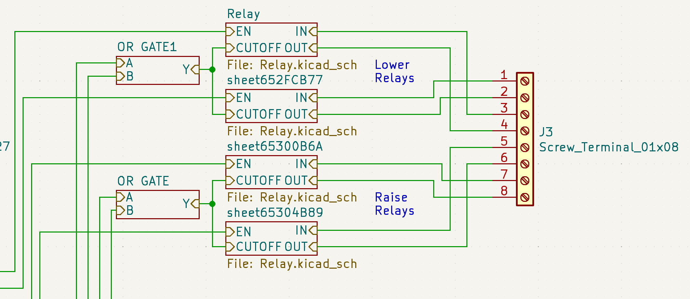
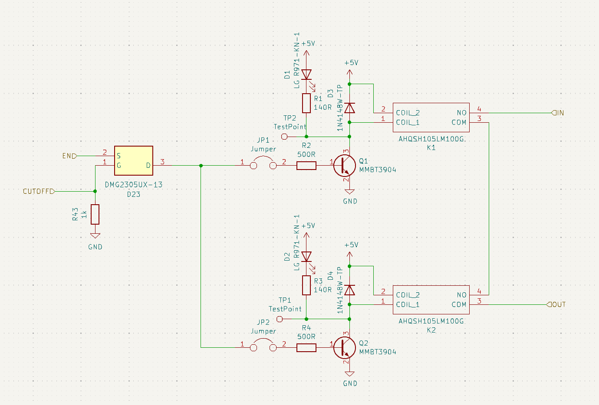
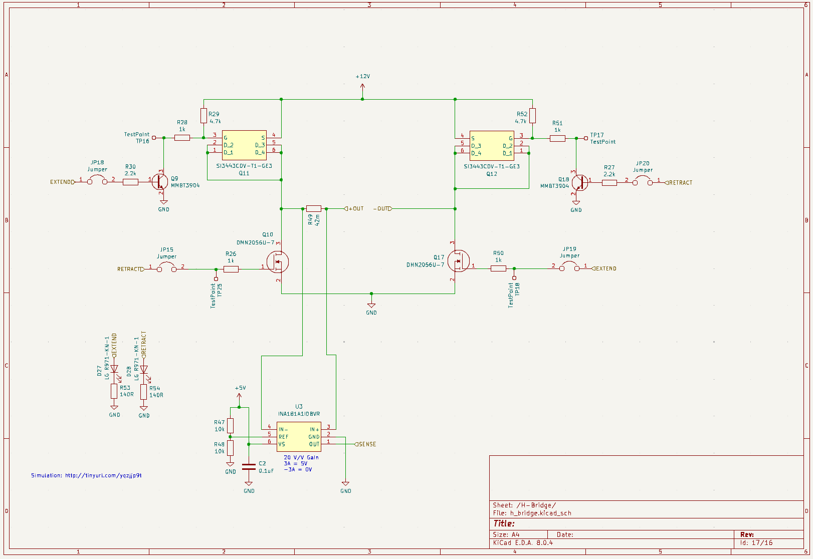
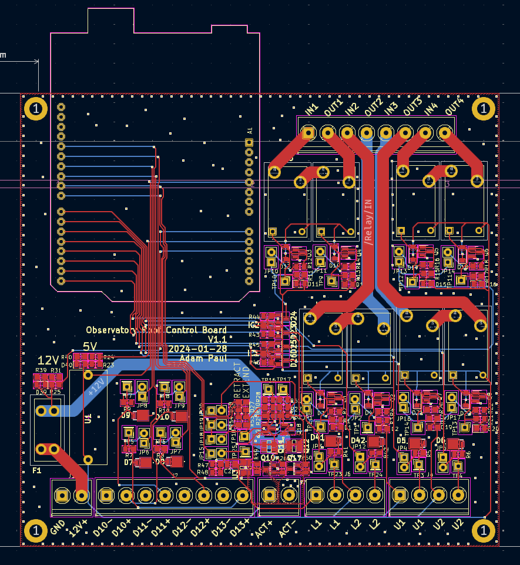
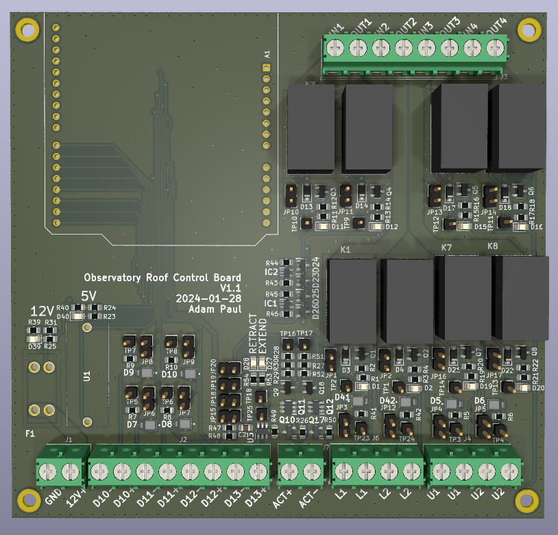

From the beginning, the plan for this observatory was full automation.

I had always wanted to be able to operate it fully remotely, and from the beginning had thought about how I could automate the roof and the telescope to control it remotely. The plan for the roof was fairly simple. I was using an electric hoist to raise and lower it already, so all that was required was to make a controller that could short the contacts in the hoist's hand controller to make it go either up or down. I could then connect that controller over serial to the server computer and I would have my remote access.

## Design

The most important criteria I had with this design was to ensure that the controller did not break anything when raising the roof. A flaw with my design was that when the roof is in the closed position it presses up against the wall of the observatory. If the hoist continues to pull when its in the closed position something will break, either the hoist cable, the roof, or the wall. None of these are desirable outcomes. You will see throughout the design multiple places where redundancy was added and thought put into making sure that the roof does not exceed its limits.

The overall design for the controller is as follows

TODO: diagram of the major components

The controller features relays to control the hoist for raising and lowering, limit switches to detect the position of the roof, and a linear actuator to move a lock into place when the roof is closed. This is all tied together with an arduino that controls all the subsystems and provides a serial interface for remote control. The entire schematic can be found here (TODO), with some interesting elements discussed below

### Hoist Control
To raise and lower the roof, the controller needs to short the contacts in the hand controller to mimic the buttons being pressed. I chose this approach as it allowed the buttons in the hand controller to still function for manual control, and ensured that the built-in emergency stop was still functional. The switch has 6 contacts that short together in the following ways

to trigger this, a relay circuit was designed that would short the upper two contacts for raising, and the lower two for lowering

*Relay circuit for raising and lowering roof*

*Closeup of a single relay element*

Mechanical relays were used to provide electrical isolation from the controller as it uses 120VAC. The relays used were also quite cheap compared to alternatives, and space was not a constraint. Two relays are used in series per channel in case a relay fails closed to ensure that it doesn't trigger the roof raise.

4 limit switches are used to detect the roof position, two at the top to detect raising and two at the bottom to detect lowering. Two switches are used for redunancy in either the switch failing or becoming misaligned. The switches are read by the Arduino so the software can stop commanding the raise/lower, but are also wired in hardware to directly disable the relays via the OR gate seen above.

### Lock

The roof control features an automated lock that holds the roof in place while in the raised position. It features a wood bar that rotates into place to lock onto the roof, and a linear actuator to rotate it. The chosen actuator can't hold a lot of weight, so care was taken to ensure that the lock was perfectly parallel with the direction of motion of the roof to ensure that when in use, little to no load was transferred to the actuator. 

TODO: Video of the lock in motion

The lock circuit is as follows

The circuit is a basic H-bridge with current sense, allowing for current to flow forwards or backwards through the actuator to raise/lower. The current sense is used to determine when the limit switch hits either end of its travel.

## Build

When laying out the board, care was put into keeping the AC circuitry separate from the rest of the design, and planning out the system such that the AC cabling could be kept away from the DC signal wires.

TODO: Thoughts on future improvements and how I would make it a commercial product

