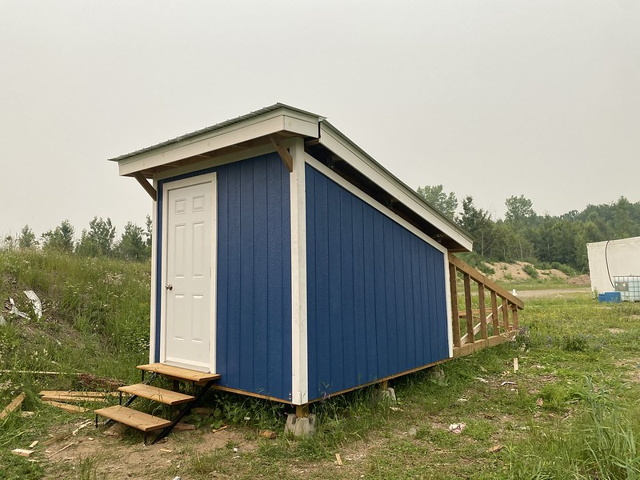
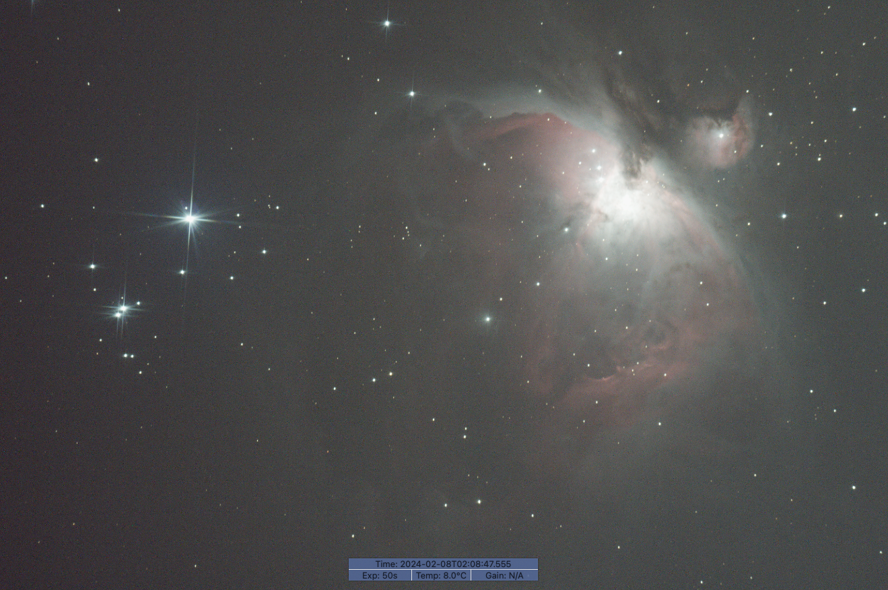
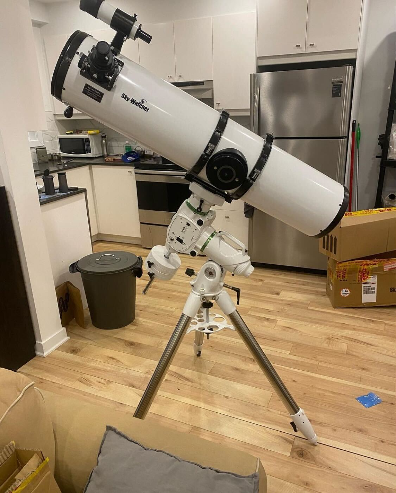

The first task in designing my observatory was selecting a location. I was renting an apartment in Montreal at the time, so I didn't have a backyard to put it in. However, the company I was working at developed rocket engines, and we had a big open test site far outside the city where they were willing to let me build the structure. The location was perfect, no light pollution, lots of space, and well secured. With this decided, I set the requirements for my project

Requirements
- Must protect the telescope and eqipment from rain and snow when closed
- When open, should allow viewing angles of 30 degrees above the horizon in any direction
- Should be able to be operated fully remotely, without an operator present on-site
- Should be able to be transported to a new location, leaving nothing permanent behind in the old location
    - This was a requirement set by the location that I was building it in

When researchin designs for the structure, I found that there were two primary types of observatories that people build, domes and roll-off roofs. Domes are your classic observatory design, with a hemispherical dome on top that has a shutter that opens to allow your telescope to view the world. They are awesome for allowing you to have wide viewing angles while protecting your telescope from the elements, plus they look very cool. Rolling roofs are simpler dsigns, essentially a shed-like structure with a roof that slides on a track, giving the telescope inside a view of the world. 

Originally, my plan was to build a dome observatory, but after doing more research I was turned away from the concept. While cool, they are much harder to build than a rolling roof, and have two moving axis instead of one. Additionally, their primary benefit over rolling roofs (increased viewing angles) is not that important, as astrophotography targets below a certain elevation from the horizon are usually not good to shoot anyway due to increased atmospheric haze and light pollution. On top of this, dome observatories can even be worse than rolling roof observatories. The small opening in the dome means that the telescope takes longer to cool down to ambient temperature at night, causing heat shimmer and distortion while observing. As a result, I dediced to go with a rolling-roof design.

The following is a series of posts detailing how I made my own custom telescope observatory over the past year. It was a project that initially began with the aim to augment my observing time and enhance my astrophotography data collection, but ended up becoming something that became a wonderful learning experience for design and construction of strucures, electronic systems, and software, while providing a cathartic break each week to go outside and build somthing with my hands, something that I was missing in my life at the time. 

*The completed observatory in August of 2023*

But why an observatory?

I had a deep love of astrophotography for years. The ability to capture and share the wonders I witnessed transformed into a technical art form for me, where the caliber of my creations was intertwined with solving engineering puzzles. This pursuit became a quest for incremental enhancements—gaining deeper insights into my equipment's operation, exploring new techniques, and experimenting with them to produce stunning photographs. I loved it, and I loved sharing the photos I created with my friends and family. There's an indescribable satisfaction in spending an entire night collecting data, uncertain of its quality, only to return home, process it, and watch a successful image emerge on the screen. It's a moment of triumph, realizing the effort has indeed paid off.

So how does astrophotography work anyway? There are a lot of wonderful blogs that explain the process in-depth that I will link here, but I also want to provide a brief overview so that you the reader can have an understanding of the proecess, the tools involved, and how an observatory makes it better. Astrophotography is categorized into two types: planetary, focusing on capturing images of planets within our solar system, and deep-sky, aimed at photographing nebulae and galaxies. My primary focus is on deep-sky astrophotography, which involves taking hundreds of long-exposure photographs of the same celestial object. These images are then combined through a technique known as stacking, where the individual photos are merged and averaged to diminish noise and amplify the signal, resulting in a final image with much more detail than any individual exposure.
| | |
|---|---|
|||
*Left: one 50 second exposure of the orion nebula. Right: A stack of 40 exposures*

To get these photos, you need a few things
- A good quality telescope, I use an 8" newtonian reflector from skywatcher
- A camera connected to your telescope where the eyepiece would typically go. I use a canon t5i modified to remove the ir-cut filter
- A mount that tracks objects as they move across the sky, keeping it steady for long exposures. I use the skywatcher EQ6-R pro

*Skywatcher telescope mounted on the EQ6-R pro. Camera not shown*

I put this telescope setup together for the first time in the fall of 2021, and I was able to get some photos that I was proud of. However, the more I captured and sought to improve, the more apparent my limitations became. Each expedition required an hour to escape the city and another hour for setup, after which I might only gather 1-2 hours of data before needing to return. Additionally, I was at the mercy of the weather, avoiding outings on nights with any cloud coverage to prevent wasted efforts. I realized that to truly enhance my astrophotography, I needed to increase the frequency and volume of data collection. Limited outings were stunting my ability to learn and refine my process. 

Thus the idea of the observatory was born. The ultimate vision I had for this project was something I could operate entirely remotely. It would be a building that covered and protected the telescope, but could open its roof to allow observations to be made. I could control it from anywhere, monitoring cloud cover and weather, and scheduling observations over the course of the night. On a clear night I could setup a series of observations, go to sleep, and wake up to a set of fresh new data, all without stepping foot outside.

As of writing, the project is still ongoing, with work continuing on some aspects of the automation. I'll try to regularly write and upload posts to add to this series, covering the design and build of the observatory, as well as some of the results!

